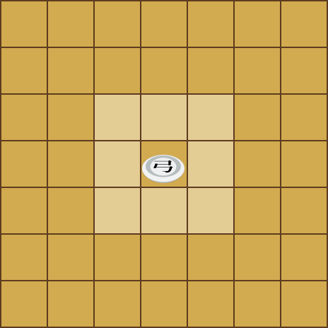
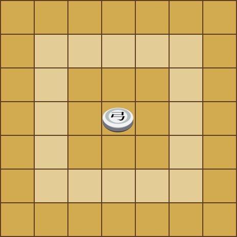
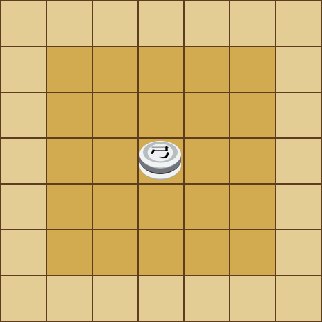

## OVERVIEW

## TABLE OF CONTENTS
- [PLACEMENT PHASE](#placement-phase)
- [PLAYER OPTIONS](#player-options)
  - [Moving](#moving)
  - [Capturing](#capturing)
  - [Stacking](#stacking)
  - [Dropping](#dropping)
- [PIECES](#pieces)
  - [Marshal](#marshal-x1)
  - [General](#general-x2)
  - [Lieutenant General](#lieutenant-general-x2)
  - [Major General](#major-general-x2)
  - [Counsel](#counsel-x2)
  - [Samurai](#samurai-x2)
  - [Knight](#knight-x2)
  - [Cannon](#cannon-x2)
  - [Musketeer](#musketeer-x2)
  - [Archer](#archer-x2)
  - [Fortress](#fortress-x2)
  - [Spy](#spy-x2)
  - [Pawn](#pawn-x9)
- [ADDITIONAL RULES](#additional-rules)

## PLACEMENT PHASE

## PLAYER OPTIONS

### Moving

### Capturing

### Stacking

### Dropping

## PIECES
### Marshal (x1)

### General (x2)

  

### Lieutenant General (x2)

### Major General (x2)

### Counsel (x2)

### Samurai (x2)

### Knight (x2)

### Cannon (x2)

### Musketeer (x2)

### Archer (x2)

  

### Fortress (x2)

### Spy (x2)

### Pawn (x9)

## ADDITIONAL RULES
